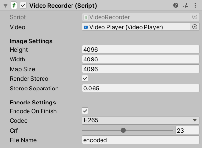

# Spherical Movie Editor

180 / 360 度動画に立体物を追加するための Unity プロジェクトです。Unity Editor 自体を動画エディタとして扱います。アプリケーションを生成するものではありません。

## 注意

出来具合はアルファ版といったところです。

一応使えますが、まだ人に勧められる完成度ではありません。しかし1からやるよりかはだいぶ楽…みたいな制作進度です。

## こういう時に使いたい（あるいは動機）

- 全天球動画を撮ったけど、タイトルや字幕が入れられなくて困った。編集ソフトなんか持ってねえよ…
- ましてやステレオスコピック（立体視の）動画は対応してるソフトも少ない…あるいは高価
- 立体の動画に後から雪を降らせたりしたい…したくない？
- Unity でできたらいいのにな……せや！

## 提供する機能

- 180 / 360 / モノスコピック / ステレオスコピックの動画を簡単な設定でレンダリング
- 動画の再生時間で Timeline をコントロールすることによる正確な編集（Timeline 上での作業を想定しています）
- Unity 上のフレームレートに依存せず、元のビデオの全フレームを確実に出力

## 提供しない機能

- 動画自体のカット・クロスフェード・色変更など。あくまで立体物を追加するためだけのものです。

## 欲しい機能

[Issues](https://github.com/yutokun/Spherical-Movie-Editor/issues) へ

## 下準備

動画を出力するには、ffmpeg の PATH を通す必要があります。（ライセンスには注意して下さい）

VR180 の場合は、Google の [VR180 Creator](https://arvr.google.com/vr180/apps/) で編集用に動画を変換して下さい。

## 使い方

WIP なのでとりあえず簡易に

SampleScene の Video Player に動画をセットします。

Assets/Timeline/Video Composition タイムライン上にオブジェクトを実装します。

VR でのプレビューは、**VideoRecorder を無効にした状態で**できるのではないでしょうか（未検証・視点の 3DoF 固定は未実装なのでベンダの SDK で）

**VideoRecorder を有効にした状態でプレイボタン**を押すと、プロジェクトフォルダ内に全てのフレームを画像として出力します。ffmpeg が使用できる場合、これをエンコードし、指定のファイル名でデスクトップに保存します。

## Licenses

### UniTask

[Copyright (c) 2019 Yoshifumi Kawai / Cysharp, Inc.](https://github.com/Cysharp/UniTask/blob/master/LICENSE)

### ffmpeg

Currently not included in this repository, but you **MUST** check when you use patented codec.

[FFmpeg License and Legal Considerations](http://ffmpeg.org/legal.html)