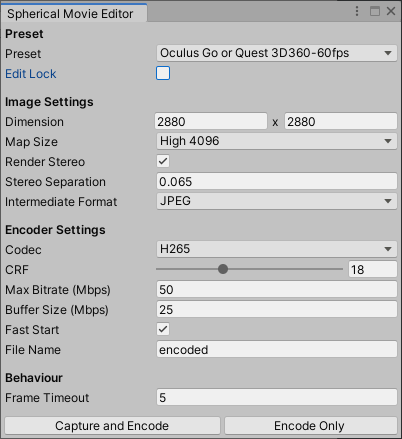

# Spherical Movie Editor

180 / 360 度動画に立体物を追加するための Unity プロジェクトです。Unity Editor 自体を動画エディタとして扱います。アプリケーションを生成するものではありません。

## こういう時に使いたい（あるいは動機）

- 全天球動画を撮ったけど、タイトルや字幕が入れられなくて困った。編集ソフトなんか持ってねえよ…
- ましてやステレオスコピック（立体視の）動画は対応してるソフトも少ない…あるいは高価
- 立体の動画に後から雪を降らせたりしたい…したくない？
- Unity でできたらいいのにな……せや！

## 提供する機能

- 各種のパノラマ動画を簡単な設定でレンダリング
  - **[WIP]** 180度 モノスコピック
  - **[WIP]** 180度 ステレオスコピック
  - **[WIP]** 360度 モノスコピック
  - 360度 ステレオスコピック
- 動画の再生時間で Timeline をコントロールすることによる正確な編集（Timeline 上での作業を想定しています）
- Unity 上のフレームレートに依存せず、元のビデオの全フレームを確実に出力
- 作業を快適に行うためのプロキシ再生モード
- ヘッドセットでのプレビュー
- ビデオのオーディオスクラブを含む Timeline 上での編集
- 動画の前後に Unity のみで作られたシーンを配置

## 提供しない機能

- 動画自体のカット・クロスフェード・色変更など。あくまで立体物を追加するためだけのものです。

## 欲しい機能

[Issues](https://github.com/yutokun/Spherical-Movie-Editor/issues) へ

## 下準備

動画を出力するには、ffmpeg の PATH を通す必要があります。（ライセンスには注意して下さい）

VR180 の場合は、Google の [VR180 Creator](https://arvr.google.com/vr180/apps/) で編集用に動画を変換して下さい。

## 使い方

### 動画の用意

立体物を追加したい動画を Unity にインポートします。Scenes/MovieEditor を開き、SphericalMovieEditor の Clip にアタッチして下さい。

| 名称          | 機能                                                         |
| ------------- | ------------------------------------------------------------ |
| Clip          | 立体物を追加したい動画をセットします                         |
| Use Proxy     | 低解像度のプロキシ動画を作成し、プレビュー再生やタイムラインでのスクラブ時に使用します。エクスポート時はオリジナルの動画が自動的に使用されます。 |
| Open Timeline | 専用の Timeline を開きます。                                 |

### 立体物の追加

シーンにオブジェクトを追加します。上記ボタンで開ける Timeline で制御すると、想定通りに出力されやすくなります。

### タイムラインの編集

Spherical Movie Editor の専用 Timeline では、動画の移動、スクラブや再生によるプレビューがサポートされています。赤で囲ってある Video Player クリップが動画の頭から終わりまでを表し、前後に移動することが出来ます。このクリップは設定された動画の長さへ自動的に伸び縮みします。

ここで動画の進行に合わせた演出を作り込んだり、動画の前後に Unity 上で作成した開始・終了アニメーションなどを追加することも可能です。

なお、動画のカット編集はサポートされていません。

### VR でのプレビュー

プレイモードで確認できます。

### 動画の出力

Movie メニューから Export... を選択すると次のウインドウが現れます。Capture and Encode を押すとデスクトップに動画を出力します。

| 名称                 | 機能                                                         |
| -------------------- | ------------------------------------------------------------ |
| **Preset**           |                                                              |
| Preset               | エンコード設定のプリセットを選択できます。Oculus Go / Quest 向けのものをあらかじめ用意しました。 |
| Edit Lock            | オンにすると、下の編集欄がグレーアウトします。自分用プリセットが決まったら、間違って変えてしまわないようにロックしておきましょう。 |
| **Image Settings**   |                                                              |
| Dimension            | 出力される動画の縦横サイズをピクセル数で指定します。         |
| Map Size             | 内部でフレームをレンダリングする際の解像度を指定します。これを大きめにすることでアーティファクトの少ない画像が得られる可能性がありますが、出力速度が大きく低下します。 |
| Render Stereo        | ステレオスコピックの動画を生成します。                       |
| Stereo Separation    | 瞳孔間距離を指定します。                                     |
| Intermediate Format  | 連番画像のフォーマットを指定します。ファイルサイズと速度の面から JPEG を推奨しています。気になる人は PNG 。 |
| **Encoder Settings** |                                                              |
| Codec                | コーデックを指定します。NVENC を使用するには、対応する GPU が必要です。 |
| CRF                  | 画質を指定します。小さくするほど画質が上がり、大きくするほど画質が下がります。H.264 では 23、H.265 では 28 が標準です。NVENC では無視されます。 |
| Max Bitrate (Mbps)   | 最大ビットレートを指定します。                               |
| Buffer Size (Mbps)   | 再生時のバッファサイズを指定します。あんまり小さくしすぎるとバッファが足りなくなって再生がカクカクするかもしれません。 |
| Fast Start           | メタデータをファイルの先頭に移動します。少ない読み込み量でも再生を開始できるようになります。 |
| File Name            | 出力するファイルの名前を指定します。拡張子は自動で付加されます。 |
| **Behaviour**        |                                                              |
| Frame Timeout        | 読み込めない動画フレームがある場合に無視するまでの秒数。     |
| Capture and Encode   | 動画の出力を開始します。                                     |
| Encode Only          | 既にキャプチャされている連番画像とオリジナルの動画ファイルを使って動画をエンコードします。コーデックや CRF のみを変えて試したい時に、キャプチャし直さなくて良いため高速です。 |

## FAQ

### パーティクルが動画に映らないんじゃが？

マテリアルを Two Sided にすると映るかもしれません。

### キャプチャが始まらないんじゃが？

しばらく待って下さい。キャプチャが進まないことを検出すると、強制的に次のフレームへ移動し、これを繰り返します。その様子はコンソールで確認できます。原因不明ですが、動画によっては先頭の数フレームを読み込めないことがあるようです。1フレーム目がキーフレームじゃない場合がある、とか…？（そんな事あるんか？）

スキップまでの秒数は上記ウインドウで設定できます。

### プリセットでエンコードしているのに、Output width must be a power of 2. が出るんじゃが？

Oculus 推奨値なので問題ありません。

### キャプチャ中、ビデオが真っ暗にレンダーされるんじゃが？

バグです。一度止めて、普通にプレイモードに入った後、止めて再度キャプチャを開始すると上手くいくことがあります。

## Licenses

### Unity Recorder

[copyright © 2019 Unity Technologies ApS](https://docs.unity3d.com/Packages/com.unity.recorder@2.2/license/LICENSE.html)

### UniTask

[Copyright (c) 2019 Yoshifumi Kawai / Cysharp, Inc.](https://github.com/Cysharp/UniTask/blob/master/LICENSE)

### ffmpeg

Currently not included in this repository, but you **MUST** check when you use patented codec.

[FFmpeg License and Legal Considerations](http://ffmpeg.org/legal.html)